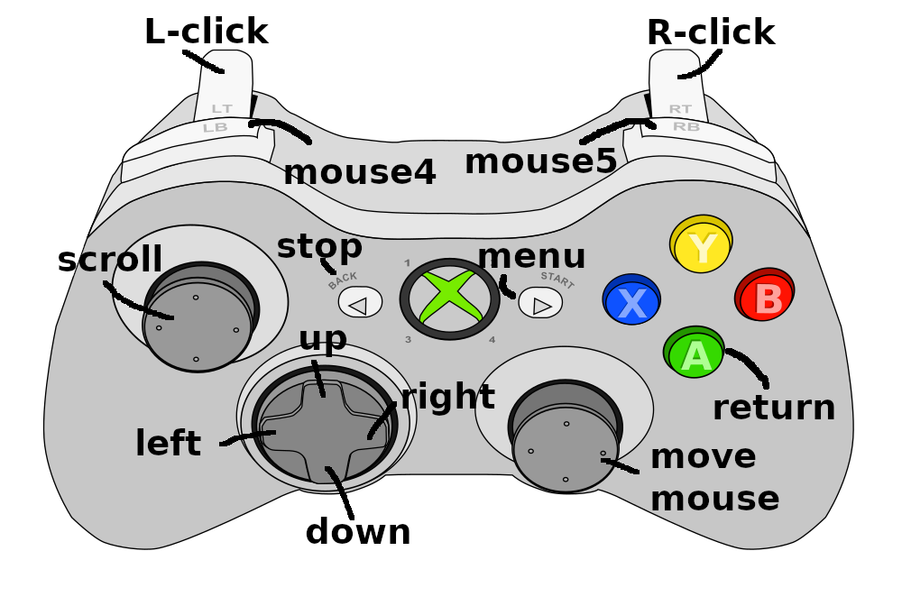

## Setup
The controllers name needs to contain the word "gamepad". If you need to change mouse speed or other parameters, you can to recompile it with the constants set.

## Installation
Simply run the executable from the latest release on Linux. (Sorry windows and mac users)

## Bindings

